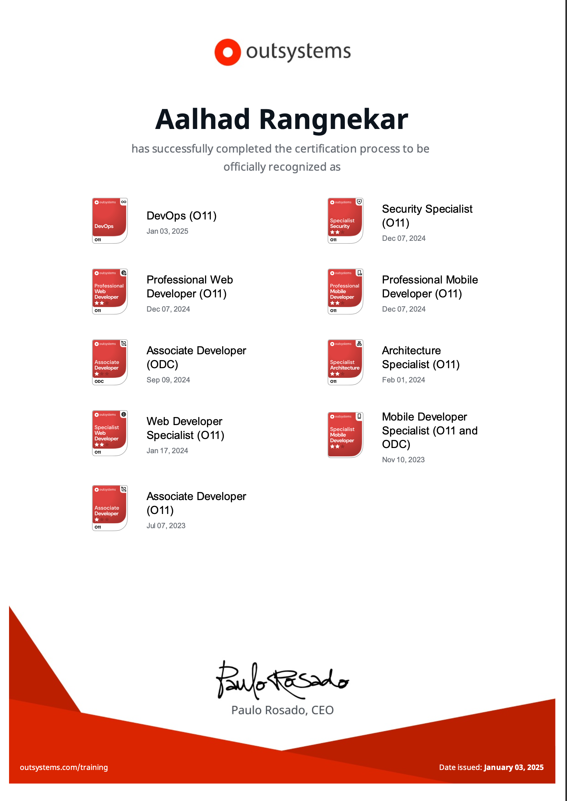

<!DOCTYPE html>
<html>
<head>
</head>
<body>
	

  

 

        <h1>About Me</h1>
        

            I used to be a Chef, an EMT, and studied supply chain in university before I fell in love with programming.
        

        

            I enjoy gaming and recently, as of a year ago, got really passionate about weightlifting.
        

        <h3>My PC Specifications</h3>
        <ul>
            <li>
                Processor:
                Ryzen 5 5600X
            </li>
            <li>
                Motherboard:
                B550M ASROCK AC
            </li>
            <li>
                RAM:
                2X16GB KLEVV CRAS XR 3600MHZ
            </li>
            <li>
                Graphics Card:
                NVIDIA RTX 4090 TRINITY OC 24GB
            </li>
            <li>
                Storage:
                1TB LEGEND 710 NVME GEN3
            </li>
            <li>
                Power Supply:
                EVGA GT1000 GOLD 80+
            </li>
            <li>
                Cooling:
                DASHFLOW 240
            </li>
        </ul>
    

<h1>Languages and Tools</h1>

  
  
  
  
  
  
  
  
  
  
  
  

	

<h1>Contact Me</h1>

  
	
  
	

</body>

